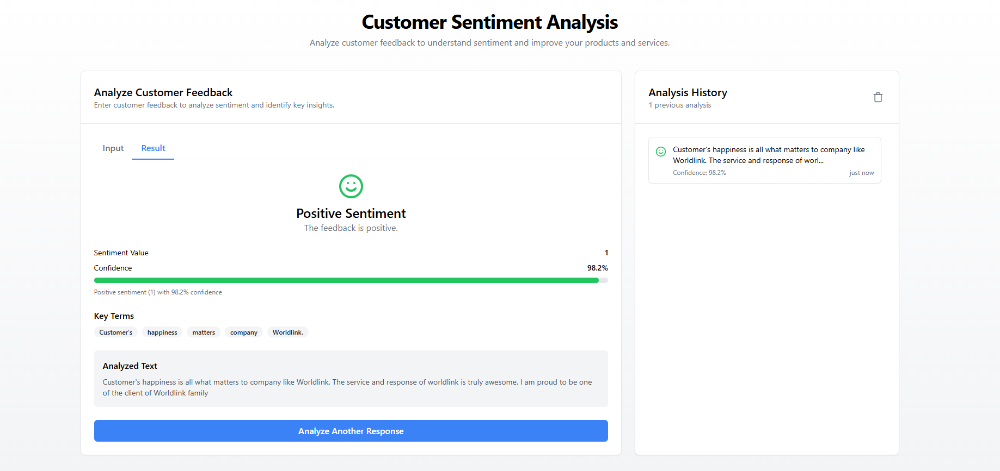

# Customer-Sentiment-Analysis" 

This project is a FastAPI-based sentiment analysis server that utilizes a  BERT model to classify text as either positive or negative. The API is designed to be used with a frontend as well as other endpoints.

---
## Report

You can read the detailed report here:
[Project Documentation](Customer_Sentiment_Report.pdf)


## Installation

### 1. Clone the repository

```sh
git clone https://github.com/sairojp/Customer-Sentiment-Analysis
cd Customer-Sentiment-Analysis
```

### 2. Create a virtual environment (optional but recommended)

### Using Conda
```sh
conda create -n sentiment python=3.11.5 -y
conda activate sentiment
pip install -r requirements.txt
```

### Using Virtual Environment (venv)
```sh
python -m venv venv
source venv/bin/activate  # On Windows use: venv\Scripts\activate
pip install -r requirements.txt
```


### 4. Run the FastAPI server

```sh
uvicorn app:app --reload
```

This will start the server on `http://127.0.0.1:8000/`

---
## Interface



## Model Safe Tensors
Since the safe tensors exceeds the size limit you need to download it here and move it inside Model.
[Model SafeTensors](https://drive.google.com/file/d/16PulXP7jeuMx6ly6Vj9ZLtLa5b523CIC/view?usp=sharing)
## Contributing
Feel free to submit issues and pull requests for improvements!

